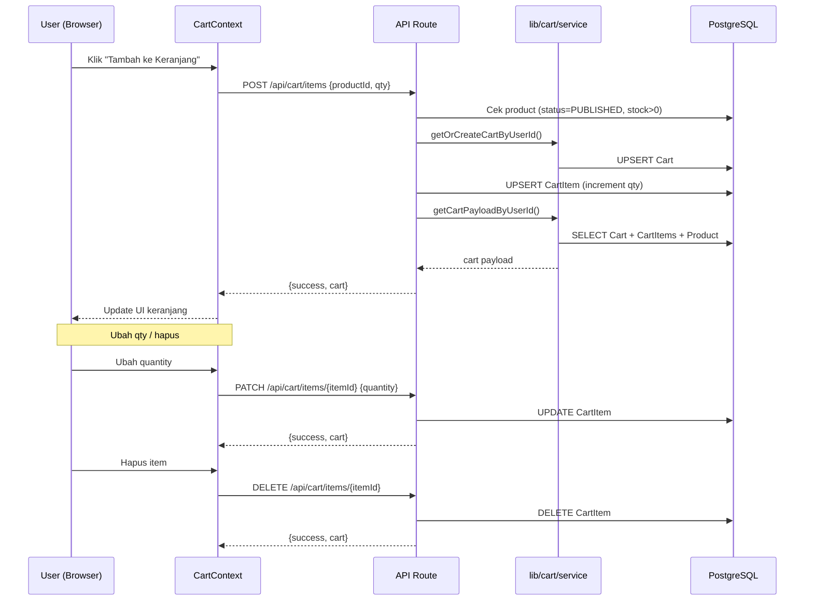
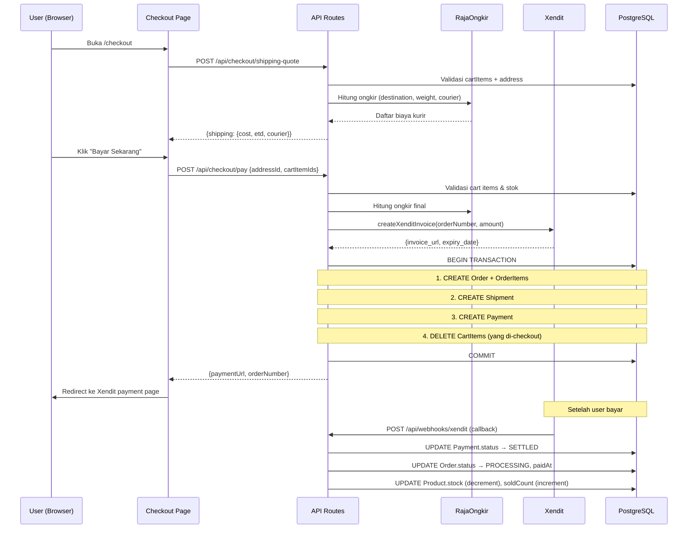
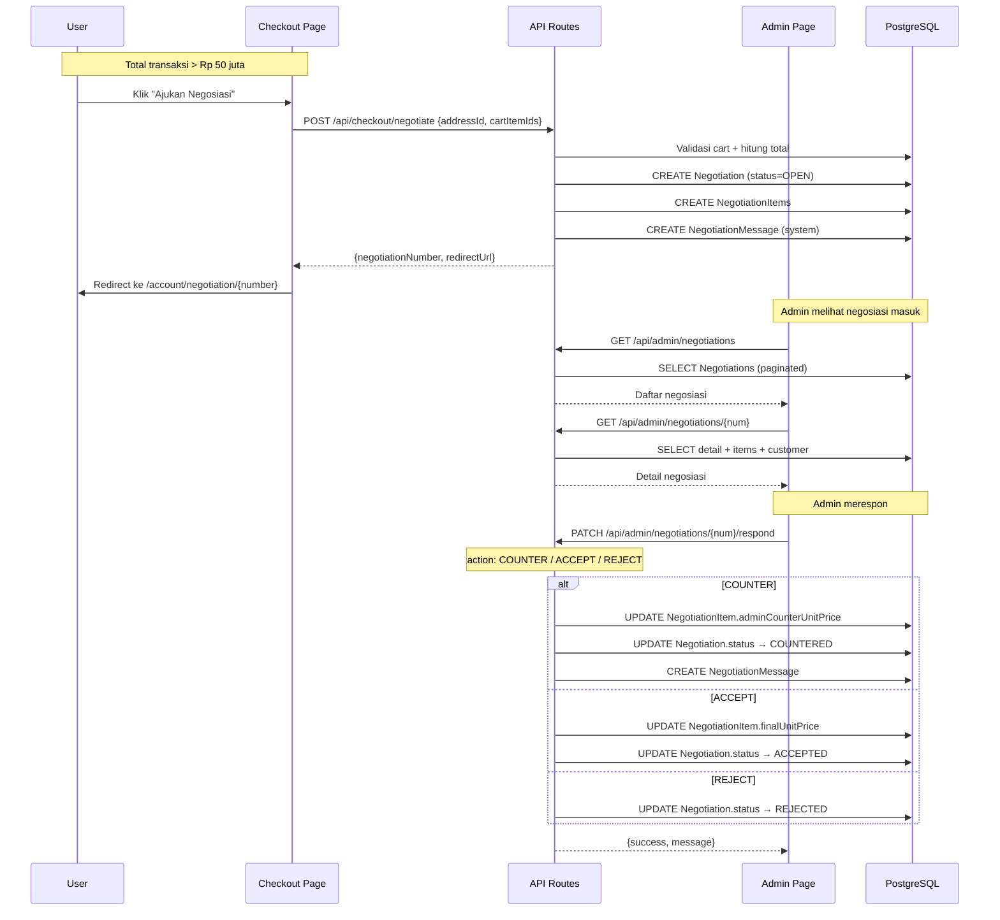
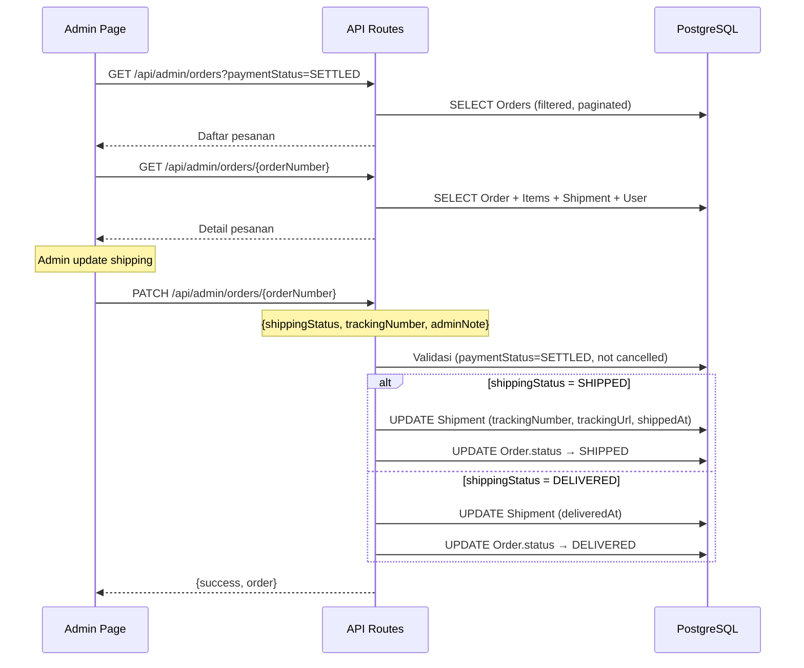
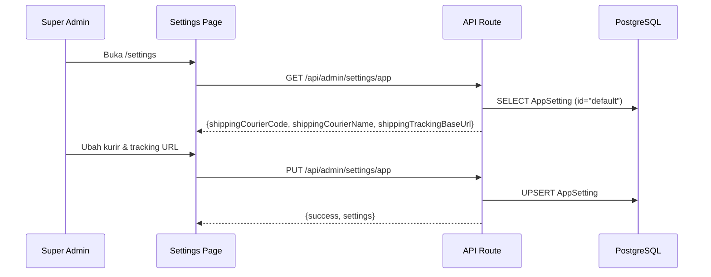

# Peta Kode Sub Modul Transaksi — Microdata Store

## Ruang Lingkup (Revisi Final)

| Aktor | Fitur |
|-------|-------|
| **User** | Keranjang, Negosiasi, Checkout, Daftar Pesanan, Daftar Negosiasi, Buat Ulasan Produk, Ubah Status Pesanan (sudah diterima) |
| **Admin** | Daftar Pesanan Masuk, Daftar Negosiasi Masuk, Proses Pesanan, Proses Negosiasi |
| **Super Admin** | Semua fitur Admin + Tambah/Edit Ekspedisi |

---

## 1. Daftar File Per Fitur

### 🛒 Keranjang (User)

| Layer | File | Fungsi |
|-------|------|--------|
| **Frontend Page** | — *(Sheet overlay, bukan halaman)* | Keranjang tampil sebagai drawer/sheet |
| **Frontend Component** | [CartSheet.tsx](file:///d:/Microdata-Store/microdata-store/components/cart-components/CartSheet.tsx) | UI sheet keranjang |
| | [CartItems.tsx](file:///d:/Microdata-Store/microdata-store/components/cart-components/CartItems.tsx) | Render daftar item keranjang |
| | [CartFooter.tsx](file:///d:/Microdata-Store/microdata-store/components/cart-components/CartFooter.tsx) | Footer keranjang (total + tombol checkout) |
| | [AddToCartButton.tsx](file:///d:/Microdata-Store/microdata-store/components/cart-components/AddToCartButton.tsx) | Tombol tambah ke keranjang |
| | [cart-context.tsx](file:///d:/Microdata-Store/microdata-store/components/cart-components/cart-context.tsx) | State global keranjang (Context + hooks) |
| **API Route** | [/api/cart/route.ts](file:///d:/Microdata-Store/microdata-store/app/api/cart/route.ts) | `GET` — Ambil isi keranjang |
| | [/api/cart/items/route.ts](file:///d:/Microdata-Store/microdata-store/app/api/cart/items/route.ts) | `POST` — Tambah item ke keranjang |
| | [/api/cart/items/[itemId]/route.ts](file:///d:/Microdata-Store/microdata-store/app/api/cart/items/%5BitemId%5D/route.ts) | `PATCH` — Ubah qty/select; `DELETE` — Hapus item |
| **Business Logic** | [lib/cart/service.ts](file:///d:/Microdata-Store/microdata-store/lib/cart/service.ts) | `getOrCreateCartByUserId`, `getCartPayloadByUserId` |
| | [lib/cart/availability.ts](file:///d:/Microdata-Store/microdata-store/lib/cart/availability.ts) | Validasi stok saat checkout |
| **Database** | `Cart`, `CartItem` | Model Prisma (schema.prisma L314–339) |

---

### 💳 Checkout (User)

| Layer | File | Fungsi |
|-------|------|--------|
| **Frontend Page** | [checkout/page.tsx](file:///d:/Microdata-Store/microdata-store/app/(user)/checkout/page.tsx) | Halaman checkout utama |
| | [checkout/success/page.tsx](file:///d:/Microdata-Store/microdata-store/app/(user)/checkout/success/page.tsx) | Halaman sukses pembayaran |
| | [checkout/failed/page.tsx](file:///d:/Microdata-Store/microdata-store/app/(user)/checkout/failed/page.tsx) | Halaman gagal pembayaran |
| **Frontend Component** | [AddressSection.tsx](file:///d:/Microdata-Store/microdata-store/app/(user)/checkout/checkout-components/AddressSection.tsx) | Pilih alamat pengiriman |
| | [ShippingSection.tsx](file:///d:/Microdata-Store/microdata-store/app/(user)/checkout/checkout-components/ShippingSection.tsx) | Info ongkir & kurir |
| | [OrderSummary.tsx](file:///d:/Microdata-Store/microdata-store/app/(user)/checkout/checkout-components/OrderSummary.tsx) | Ringkasan pesanan |
| | [OrderItem.tsx](file:///d:/Microdata-Store/microdata-store/app/(user)/checkout/checkout-components/OrderItem.tsx) | Render per item pesanan |
| | [OrderFooter.tsx](file:///d:/Microdata-Store/microdata-store/app/(user)/checkout/checkout-components/OrderFooter.tsx) | Footer checkout (bayar / negosiasi) |
| | [types.ts](file:///d:/Microdata-Store/microdata-store/app/(user)/checkout/checkout-components/types.ts) | Type definitions checkout |
| **API Route** | [/api/checkout/pay/route.ts](file:///d:/Microdata-Store/microdata-store/app/api/checkout/pay/route.ts) | `POST` — Buat order + invoice Xendit |
| | [/api/checkout/shipping-quote/route.ts](file:///d:/Microdata-Store/microdata-store/app/api/checkout/shipping-quote/route.ts) | `POST` — Hitung estimasi ongkir |
| | [/api/checkout/negotiate/route.ts](file:///d:/Microdata-Store/microdata-store/app/api/checkout/negotiate/route.ts) | `POST` — Ajukan negosiasi dari checkout |
| **Business Logic** | [lib/payment/xendit.ts](file:///d:/Microdata-Store/microdata-store/lib/payment/xendit.ts) | Integrasi Xendit (buat invoice, mapping status) |
| | [lib/shipping/rajaongkir.ts](file:///d:/Microdata-Store/microdata-store/lib/shipping/rajaongkir.ts) | Integrasi RajaOngkir (hitung ongkir) |
| | [lib/shipping/config.ts](file:///d:/Microdata-Store/microdata-store/lib/shipping/config.ts) | Konfigurasi provider ongkir |
| | [lib/shipping/couriers.ts](file:///d:/Microdata-Store/microdata-store/lib/shipping/couriers.ts) | Mapping nama kurir |
| | [lib/cart/availability.ts](file:///d:/Microdata-Store/microdata-store/lib/cart/availability.ts) | Validasi stok |
| **Webhook** | [/api/webhooks/xendit/route.ts](file:///d:/Microdata-Store/microdata-store/app/api/webhooks/xendit/route.ts) | Callback Xendit (update status bayar + stok) |
| **Database** | `Order`, `OrderItem`, `Payment`, `PaymentEvent`, `Shipment` | Model Prisma |

---

### 📦 Daftar Pesanan & Detail Pesanan (User)

| Layer | File | Fungsi |
|-------|------|--------|
| **Frontend Page** | [account/order/page.tsx](file:///d:/Microdata-Store/microdata-store/app/(user)/account/order/%5Bslug%5D/page.tsx) | Redirect / placeholder |
| | [account/order/[slug]/page.tsx](file:///d:/Microdata-Store/microdata-store/app/(user)/account/order/%5Bslug%5D/page.tsx) | Halaman detail pesanan user |
| **Frontend Component** | [OrdersListSection.tsx](file:///d:/Microdata-Store/microdata-store/app/(user)/account/OrdersListSection.tsx) | Daftar pesanan user (36KB, client component) |
| | [OrderDetailSection.tsx](file:///d:/Microdata-Store/microdata-store/app/(user)/account/OrderDetailSection.tsx) | Detail pesanan user (20KB, client component) |
| **Business Logic** | [lib/orders/serializers.ts](file:///d:/Microdata-Store/microdata-store/lib/orders/serializers.ts) | `serializeOrderListItem`, `serializeOrderDetail`, label status |
| | [lib/orders/expiration.ts](file:///d:/Microdata-Store/microdata-store/lib/orders/expiration.ts) | `syncExpiredPendingOrders` |
| **Database** | `Order`, `OrderItem`, `Shipment`, `Payment` | Model Prisma |

> [!WARNING]
> **Fitur "Ubah Status Pesanan (sudah diterima)" dari sisi User** — saat ini belum terlihat ada API endpoint khusus untuk user mengubah status pesanan menjadi `COMPLETED`. Perubahan status order dilakukan oleh **Admin** melalui shipping status (`DELIVERED` → otomatis `DELIVERED` di order). User belum memiliki tombol "Pesanan Diterima" yang mengubah status ke `COMPLETED`.

---

### 🤝 Negosiasi (User)

| Layer | File | Fungsi |
|-------|------|--------|
| **Frontend Page** | [account/negotiations/page.tsx](file:///d:/Microdata-Store/microdata-store/app/(user)/account/negotiations/page.tsx) | Halaman daftar negosiasi user |
| | [account/negotiation/[slug]/page.tsx](file:///d:/Microdata-Store/microdata-store/app/(user)/account/negotiation/%5Bslug%5D/page.tsx) | Detail negosiasi user |
| **Frontend Component** | [NegotiationsListSection.tsx](file:///d:/Microdata-Store/microdata-store/app/(user)/account/NegotiationsListSection.tsx) | Daftar negosiasi (11KB) |
| | [NegotiationDetailSection.tsx](file:///d:/Microdata-Store/microdata-store/app/(user)/account/NegotiationDetailSection.tsx) | Detail negosiasi + chat (17KB) |
| | [NegotiationStatusBadge.tsx](file:///d:/Microdata-Store/microdata-store/app/(user)/account/NegotiationStatusBadge.tsx) | Badge status negosiasi |
| | [negotiation-data.ts](file:///d:/Microdata-Store/microdata-store/app/(user)/account/negotiation-data.ts) | Data fetching helper |
| **API Route** | [/api/checkout/negotiate/route.ts](file:///d:/Microdata-Store/microdata-store/app/api/checkout/negotiate/route.ts) | `POST` — Buat negosiasi baru |
| **Business Logic** | [lib/negotiations/serializers.ts](file:///d:/Microdata-Store/microdata-store/lib/negotiations/serializers.ts) | Serializer list & detail |
| | [lib/negotiations/utils.ts](file:///d:/Microdata-Store/microdata-store/lib/negotiations/utils.ts) | Generate nomor, label status, threshold |
| | [lib/negotiations/validation.ts](file:///d:/Microdata-Store/microdata-store/lib/negotiations/validation.ts) | Zod schema validasi |
| **Database** | `Negotiation`, `NegotiationItem`, `NegotiationMessage` | Model Prisma |

---

### ⭐ Buat Ulasan Produk (User)

> [!WARNING]
> **Belum ditemukan API endpoint khusus** untuk user membuat/mengirim ulasan. Model `Review` dan `ReviewImage` sudah ada di database, tapi **belum ada** route API `POST /api/reviews` atau sejenisnya. Fitur ini kemungkinan belum diimplementasikan di backend.

| Layer | File | Status |
|-------|------|--------|
| **Database** | `Review`, `ReviewImage` | ✅ Model sudah ada (schema.prisma L539–572) |
| **API Route** | — | ❌ Belum ada endpoint create review |
| **Frontend** | — | ❌ Belum ada form/halaman buat ulasan |

---

### 📋 Daftar Pesanan Masuk & Proses Pesanan (Admin)

| Layer | File | Fungsi |
|-------|------|--------|
| **Frontend Page** | [orders/page.tsx](file:///d:/Microdata-Store/microdata-store/app/(admin)/orders/page.tsx) | Daftar & detail pesanan admin (16KB, all-in-one) |
| **API Route** | [/api/admin/orders/route.ts](file:///d:/Microdata-Store/microdata-store/app/api/admin/orders/route.ts) | `GET` — List pesanan (filter, pagination) |
| | [/api/admin/orders/[orderNumber]/route.ts](file:///d:/Microdata-Store/microdata-store/app/api/admin/orders/%5BorderNumber%5D/route.ts) | `GET` — Detail; `PATCH` — Update shipping status + resi |
| | [/api/admin/sidebar-badges/route.ts](file:///d:/Microdata-Store/microdata-store/app/api/admin/sidebar-badges/route.ts) | Badge count pesanan & negosiasi pending |
| **Business Logic** | [lib/orders/admin-serializers.ts](file:///d:/Microdata-Store/microdata-store/lib/orders/admin-serializers.ts) | Serializer admin order |
| | [lib/orders/admin-validation.ts](file:///d:/Microdata-Store/microdata-store/lib/orders/admin-validation.ts) | Zod schema query & update |
| | [lib/orders/admin-receipt-pdf.ts](file:///d:/Microdata-Store/microdata-store/lib/orders/admin-receipt-pdf.ts) | Generate receipt PDF |
| | [lib/orders/expiration.ts](file:///d:/Microdata-Store/microdata-store/lib/orders/expiration.ts) | Sync expired orders |
| | [lib/orders/upload-client.ts](file:///d:/Microdata-Store/microdata-store/lib/orders/upload-client.ts) | Upload helper |
| **Database** | `Order`, `OrderItem`, `Shipment`, `Payment` | Model Prisma |

---

### 🤝 Daftar Negosiasi Masuk & Proses Negosiasi (Admin)

| Layer | File | Fungsi |
|-------|------|--------|
| **Frontend Page** | [negotiations/page.tsx](file:///d:/Microdata-Store/microdata-store/app/(admin)/negotiations/page.tsx) | Daftar negosiasi admin |
| | [negotiations/[slug]/page.tsx](file:///d:/Microdata-Store/microdata-store/app/(admin)/negotiations/%5Bslug%5D/page.tsx) | Wrapper detail |
| | [negotiations/[slug]/NegotiationDetailClient.tsx](file:///d:/Microdata-Store/microdata-store/app/(admin)/negotiations/%5Bslug%5D/NegotiationDetailClient.tsx) | Detail + form respon admin (16KB) |
| **API Route** | [/api/admin/negotiations/route.ts](file:///d:/Microdata-Store/microdata-store/app/api/admin/negotiations/route.ts) | `GET` — List negosiasi |
| | [/api/admin/negotiations/[num]/route.ts](file:///d:/Microdata-Store/microdata-store/app/api/admin/negotiations/%5BnegotiationNumber%5D/route.ts) | `GET` — Detail negosiasi |
| | [/api/admin/negotiations/[num]/respond/route.ts](file:///d:/Microdata-Store/microdata-store/app/api/admin/negotiations/%5BnegotiationNumber%5D/respond/route.ts) | `PATCH` — Counter / Accept / Reject |
| **Business Logic** | [lib/negotiations/serializers.ts](file:///d:/Microdata-Store/microdata-store/lib/negotiations/serializers.ts) | Serializer negosiasi |
| | [lib/negotiations/validation.ts](file:///d:/Microdata-Store/microdata-store/lib/negotiations/validation.ts) | Schema respon admin |
| | [lib/negotiations/utils.ts](file:///d:/Microdata-Store/microdata-store/lib/negotiations/utils.ts) | Helper utils |
| **Database** | `Negotiation`, `NegotiationItem`, `NegotiationMessage` | Model Prisma |

---

### 🚚 Tambah/Edit Ekspedisi (Super Admin)

| Layer | File | Fungsi |
|-------|------|--------|
| **Frontend Page** | [settings/page.tsx](file:///d:/Microdata-Store/microdata-store/app/(admin)/settings/page.tsx) | Halaman settings admin (61KB, termasuk ekspedisi) |
| **API Route** | [/api/admin/settings/app/route.ts](file:///d:/Microdata-Store/microdata-store/app/api/admin/settings/app/route.ts) | `GET` — Baca settings; `PUT` — Update kurir & tracking URL |
| **Business Logic** | [lib/settings/app-settings.ts](file:///d:/Microdata-Store/microdata-store/lib/settings/app-settings.ts) | `getAppSettings`, `getPublicAppSettings` |
| | [lib/settings/validation.ts](file:///d:/Microdata-Store/microdata-store/lib/settings/validation.ts) | Zod schema settings |
| | [lib/shipping/couriers.ts](file:///d:/Microdata-Store/microdata-store/lib/shipping/couriers.ts) | Mapping kode kurir → nama |
| | [lib/shipping/config.ts](file:///d:/Microdata-Store/microdata-store/lib/shipping/config.ts) | Konfigurasi provider (RajaOngkir API key, origin) |
| **Database** | `AppSetting` | Model Prisma (schema.prisma L591–599) |

---

## 2. Tabel Database yang Terlibat

| Model | Terkait Fitur | Enum Status |
|-------|---------------|-------------|
| `Cart` | Keranjang | — |
| `CartItem` | Keranjang | — |
| `Order` | Checkout, Pesanan | `OrderStatus`: PENDING_PAYMENT → PAID → PROCESSING → SHIPPED → DELIVERED → COMPLETED / CANCELLED / EXPIRED / REFUNDED |
| `OrderItem` | Checkout, Pesanan, Ulasan | — |
| `Payment` | Checkout | `PaymentStatus`: PENDING → SETTLED / EXPIRED / CANCELLED / FAILED / ... |
| `PaymentEvent` | Webhook | — |
| `Shipment` | Checkout, Proses Pesanan | `ShipmentStatus`: WAITING_FULFILLMENT → READY_TO_SHIP → SHIPPED → DELIVERED / CANCELLED |
| `Negotiation` | Negosiasi | `NegotiationStatus`: OPEN → COUNTERED → ACCEPTED / REJECTED / EXPIRED / CANCELLED |
| `NegotiationItem` | Negosiasi | — |
| `NegotiationMessage` | Negosiasi | `MessageSenderRole`: USER / ADMIN / SYSTEM |
| `Review` | Ulasan | `ReviewStatus`: PUBLISHED / HIDDEN / REPORTED / DELETED |
| `ReviewImage` | Ulasan | — |
| `AppSetting` | Ekspedisi | — |

---

## 3. Alur (Flow) Per Fitur

### 🛒 Alur Keranjang

---

### 💳 Alur Checkout (Bayar Langsung)

---

### 🤝 Alur Negosiasi

---

### 📦 Alur Proses Pesanan (Admin)

---

### 🚚 Alur Tambah/Edit Ekspedisi (Super Admin)

---

## 4. File Pendukung (Shared)

| File | Fungsi |
|------|--------|
| [lib/prisma.ts](file:///d:/Microdata-Store/microdata-store/lib/prisma.ts) | Singleton Prisma Client |
| [lib/auth/api-guard.ts](file:///d:/Microdata-Store/microdata-store/lib/auth) | `requireUser()`, `requireAdmin()` — auth guard API |
| [middleware.ts](file:///d:/Microdata-Store/microdata-store/middleware.ts) | Next.js middleware (route protection) |
| [lib/utils.ts](file:///d:/Microdata-Store/microdata-store/lib/utils.ts) | Helper umum |
| [prisma/schema.prisma](file:///d:/Microdata-Store/microdata-store/prisma/schema.prisma) | Definisi seluruh model database |

---

## 5. Temuan Penting

> [!IMPORTANT]
> **2 fitur User belum lengkap implementasinya:**
>
> 1. **Ubah Status Pesanan (sudah diterima)** — Belum ada API endpoint bagi user untuk mengubah order dari `DELIVERED` → `COMPLETED`. Saat ini hanya admin yang bisa mengubah shipping status.
>
> 2. **Buat Ulasan Produk** — Model `Review` + `ReviewImage` sudah ada di database, tapi belum ada API `POST` untuk user membuat ulasan, dan belum ada halaman frontend form ulasan.

> [!NOTE]
> **Fitur yang sudah lengkap end-to-end (frontend → API → database):**
> - ✅ Keranjang (tambah, ubah qty, hapus, select/deselect)
> - ✅ Checkout + Pembayaran (Xendit) + Webhook
> - ✅ Negosiasi User (ajukan dari checkout)
> - ✅ Daftar Pesanan User
> - ✅ Detail Pesanan User
> - ✅ Daftar & Detail Negosiasi User
> - ✅ Proses Pesanan Admin (update shipping + resi)
> - ✅ Proses Negosiasi Admin (counter/accept/reject)
> - ✅ Tambah/Edit Ekspedisi (Super Admin via Settings)
